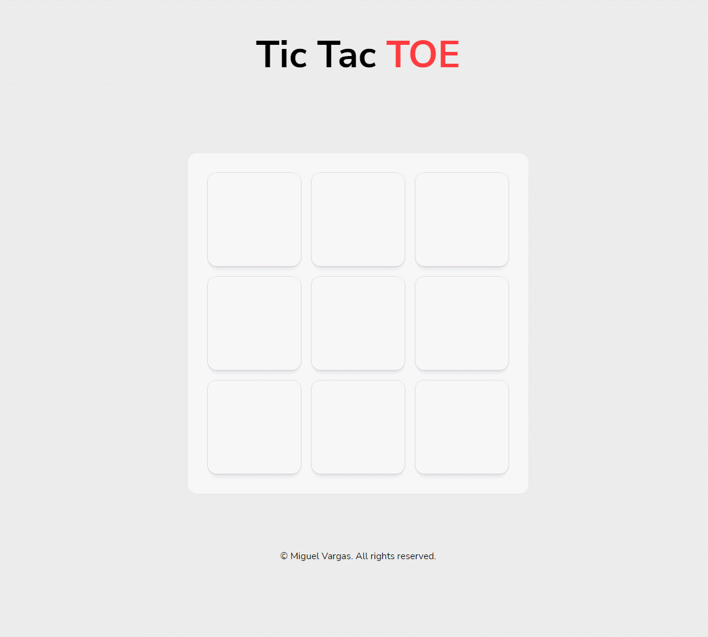
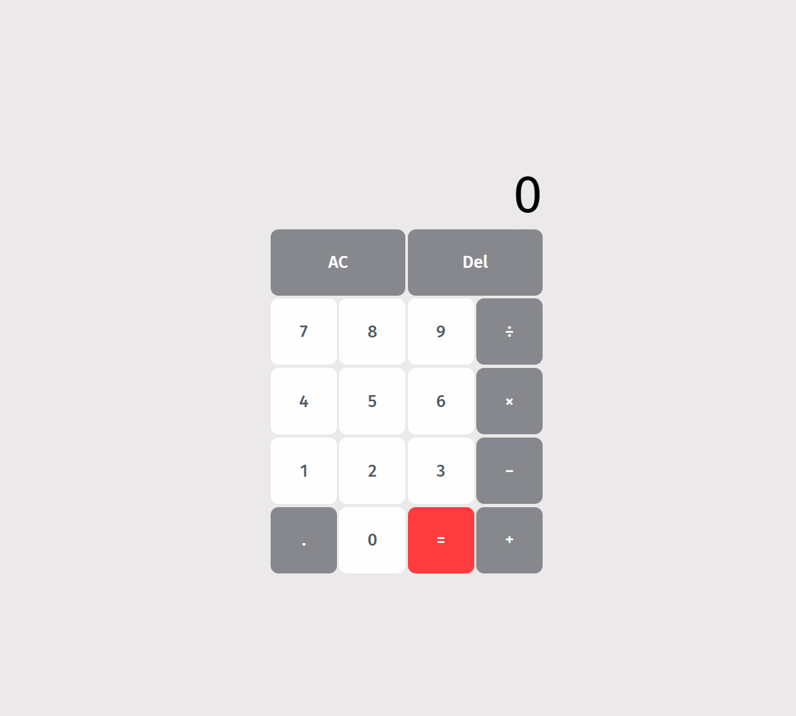

<h1 align="center">Hi 👋, I'm Miguel</h1>
<h3 align="center">A full stack software engineer from Philadelphia, PA.</h3>

- 💼 Accepting new clients. Check out my [portfolio!](https://miguelvargas.dev/)

- 📫 Email me at [contact@miguelvargas.dev](mailto:contact@miguelvargas.dev)

<h2 align="left">Projects:</h2>

  <table>
      <tr>
        <td width="50%">
          <h3 align="center">Tic Tac Toe</h3>
          

            
               
            

              A tic tac toe game created to practice OOP principles.
            

          

        </td>
        <td width="50%">
          <h3 align="center">Calculate!</h3>
          

            
               
            

              A basic calculator made to practice using JavaScript.
            

          

        </td>
      </tr>
  </table>

